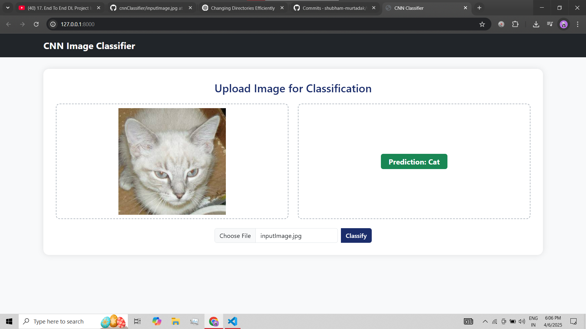

# 🧠 CNNClassifier - End-to-End Deep Learning Project

This is an end-to-end deep learning project that implements a **CNN-based image classification system**. The project is structured from data ingestion to model deployment and demonstrates best practices in machine learning workflows, modular code design, and CI/CD for real-world deployment.

## 🚀 Live Demo
Access the deployed application here: [http://51.21.102.120:8080/](http://51.21.102.120:8080/)

## Screenshot :

---

## 📁 Project Structure

The project is divided into multiple well-organized modules:

1. **Data Ingestion**  
   Responsible for loading and preprocessing image datasets for model training and evaluation.

2. **Model Building & Loading**  
   Defined a custom Convolutional Neural Network (CNN) using TensorFlow-Keras.

3. **Model Training**  
   Trained the model using the prepared datasets and saved the best-performing model.

4. **Model Evaluation**  
   Evaluated performance using accuracy metrics and visual analysis.

5. **Deployment**  
   - Dockerized the application for containerized deployment.
   - Created and pushed the Docker image to **AWS Elastic Container Registry (ECR)**.
   - Deployed the application on an **AWS EC2 instance** using **CI/CD GitHub Actions**.

---

## 🛠️ Tech Stack

- **Python**
- **Flask** - Web Framework
- **TensorFlow / Keras** - Deep Learning Model
- **HTML, CSS, Bootstrap** - Frontend
- **Docker** - Containerization
- **AWS**  
  - EC2 (Deployment)  
  - ECR (Docker Image Registry)  
- **GitHub Actions** - CI/CD Pipeline

---

## 📦 Deployment Pipeline Overview

1. GitHub Actions trigger on code push.
2. Docker image is built and pushed to AWS ECR.
3. EC2 instance pulls the latest Docker image.
4. Application is run using Docker on the EC2 instance.

---

## 📝 Author

**Shubham Murtadak** - *(AI & ML Engineer)*  

[LinkedIn](https://www.linkedin.com/in/shubham-murtadak-287991237/)

---

